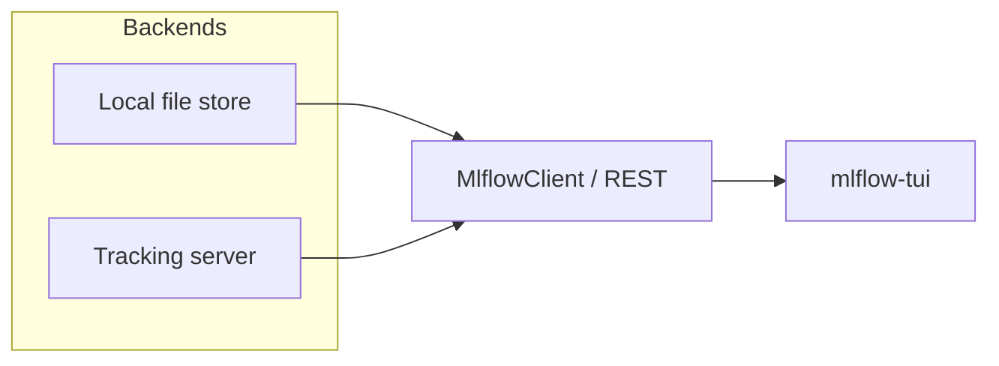

# mlflow-tui

A terminal UI for [MLflow](https://mlflow.org) tracking.

MLflow already exposes experiments, runs, metrics, params, tags, and artifacts through its tracking API. This is another client for that API — the same workflow as `mlflow ui`, without leaving the terminal.

```
mlflow-tui
├── Experiments
│   ├── LT-JEPA
│   ├── transformer-baseline
│   └── ablations
│
├── Runs
│   NAME          STATUS     LOSS      GPU
│   run-0042      ● running  0.0381    91%
│   run-0041      ✓ done     0.0402    -
│   run-0040      ✕ failed   0.0891    -
│
└── Selected Run
    loss
    0.10 ┤╮
    0.08 ┤╰╮
    0.06 ┤ ╰─╮
    0.04 ┤   ╰───────

    lr        3e-4
    epoch     17 / 50
    samples   42.1M
```

## Why

The browser UI is the right tool for some things. It is not the right tool when you are already on a training box, in tmux, watching a run. `mlflow-tui` talks to a local file store or a remote tracking server and keeps the core loop in one screen: pick an experiment, scan runs, plot a metric, inspect params/tags/artifacts.

No MLflow server changes. The TUI is a client:




## Install

```bash
uv tool install mlflow-tui
# or
pip install mlflow-tui
```

From this repo:

```bash
uv sync
uv run mlflow-tui --demo
```

## Usage

```bash
mlflow-tui
mlflow-tui --tracking-uri http://localhost:5000
mlflow-tui --tracking-uri https://mlflow.mycompany.ca
mlflow-tui --tracking-uri file:./mlruns
mlflow-tui --demo
```

`MLFLOW_TRACKING_URI` and `MLFLOW_TRACKING_TOKEN` are honored the same way the official Python client uses them.

### Keys

| Key | Action |
| --- | --- |
| `tab` | Cycle panes |
| `/` | Filter experiments and runs |
| `r` | Refresh |
| `m` | Cycle the plotted metric |
| `space` | Mark a run |
| `c` | Compare marked runs |
| `y` | Copy the selected run ID |
| `q` | Quit |

Filter accepts a substring, or an MLflow search expression such as `metrics.loss < 0.05`.

Live refresh defaults to every 3 seconds (`--refresh 0` disables it). Running runs keep their metric history moving.

## Status

v0.1 is the MVP: experiments → runs → metric plot → params/tags/artifacts, plus mark/compare and live refresh.

Next: richer run comparison, artifact previews, and tighter streaming for long metric histories.

## Development

```bash
uv sync --group dev
uv run pytest
uv run ruff check src tests
uv run ruff format src tests
uv run mlflow-tui --demo
```
